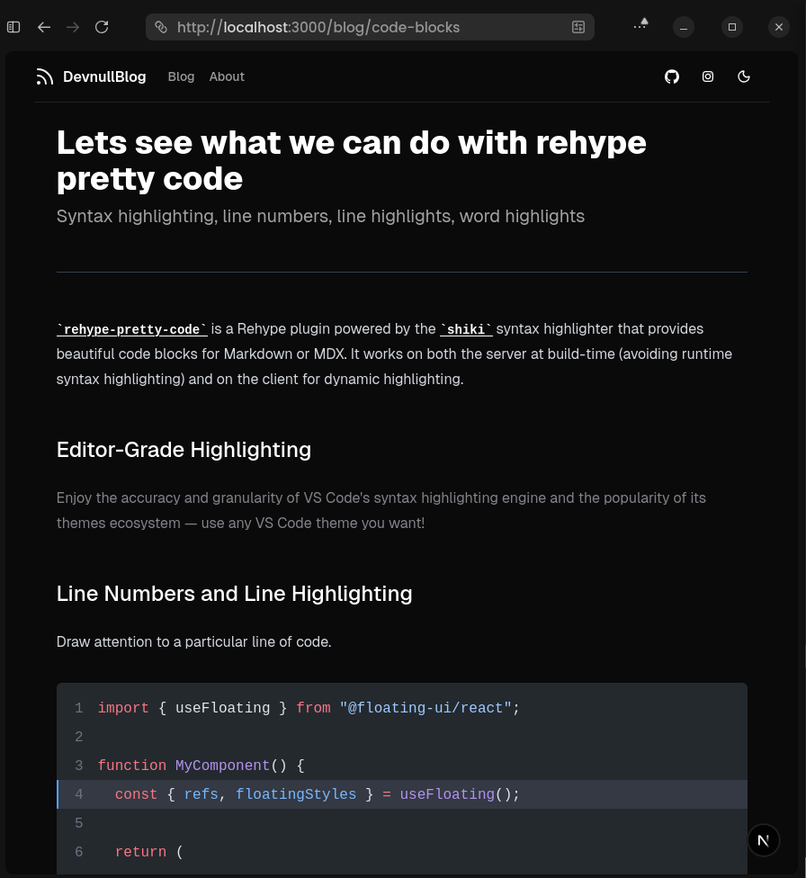

<h1 align="center">A Blog Template Application built using Next.js 16, Tailwind CSS, Shadcn UI, MDX, Velite, and Docker</h1>

<div align="center">

&nbsp;
&nbsp;
&nbsp;
&nbsp;
&nbsp;
&nbsp;

</div>

<p align="center">
 
</p>

## Description

This repository is a simple implementaion of a markdown static blog, a demo can be seen [here](https://nextjs-velite-blog-template-mu.vercel.app/).

<picture>
  <source srcset="https://velite.js.org/assets/flow-dark.svg" media="(prefers-color-scheme: dark)">
  
</picture>

## Features

- MDX Components
- Shadcn UI
- Pagination
- Dynamic Open Graph Image
- Syntax Highlighting in Code Block using Shiki and Rehype
- Docker Support
- Velite Integration for Content Pipeline

## Running the Application

- Using bun

```bash
git clone https://github.com/armandwipangestu/nextjs-velite-blog-template.git

cd nextjs-velite-blog-template

bun install

bun run dev
```

- Using docker

```bash
docker run --rm -p 3000:3000 ghcr.io/armandwipangestu/nextjs-velite-blog-template:latest
```

## Roadmap

The following are the features I want to achieve or are under development:

- [ ✅ ] Add some style type like github to callout component (`note`, `tip`, `important`, `warning`, `caution`)
- [ ✅ ] Light / Dark mode theme in code block
- [ ✅ ] Remove backtick in inline code
- [ ✅ ] Adjust background line and word highlight in code block
- [ ✅ ] Add multiple word highlighting based on char ids `#v` (variable/value) , `#s` (state/stateful) , `#i` (import/identifier)
- [ ✅ ] Add title bar (language icon, copy button, etc) in code block
- [ ✅ ] Make some logic to override language icon using `icon="..."` meta string
- [ ✅ ] Custom font for code block using `font="..."` meta string
- [ ✅ ] Disable ligature for code block using `fontLigatures=false` meta string
- [ ✅ ] Inline code (without specific language) with custom background color
- [ ✅ ] Add umami analytics
- [ ✅ ] Add vercel analytics
- [ ✅ ] Rehype transformers for diff notation
- [ ✅ ] Add code block focus
- [ ] Add code block error and warning
- [ ] Add giscus components for discussion section
- [ ] Code block group components

See the [open issues](https://github.com/armandwipangestu/nextjs-velite-blog-template/issues) for a list of proposed features (and known issues).

## Credits

Much of the design of this project is taken from shadcn in his projects, such as [shadcn/ui](https://ui.shadcn.com/) and [Taxonomy](https://tx.shadcn.com/).

Another credit goes to [Jolly Coding](https://youtu.be/tSI98g3PDyE?si=bqgUHaJsqzyCJorx) with this repository [here](https://github.com/jolbol1/nextjs-velite-blog-template).