# Example

## Mermaid

```mermaid
erDiagram
    USERS {
        bigint_unsigned id PK "User ID"
        varchar(255) name "User Name"
        varchar(255) avatar "User Avatar URL"
        varchar(255) email "User Email"
        timestamp email_verified_at
        varchar(255) password
        varchar(100) remember_token
        timestamp created_at "User Created At"
        timestamp updated_at "User Updated At"
    }

    PROFILES {
        bigint_unsigned id PK "User Profile ID"
        enum theme "ENUM['light', 'dark', 'system']"
        enum gender "ENUM['male', 'female', 'prefer_not_to_say']"
        bigint_unsigned user_id FK
        timestamp created_at "User Profile Created At"
        timestamp updated_at "User Profile Updated At"
    }

    ROLES {
        bigint_unsigned id PK "Role ID"
        varchar(255) name "Role Name"
        varchar(255) guard_name "Role Guard Name"
        timestamp created_at "Role Created At"
        timestamp updated_at "Role Updated At"
    }

    PERMISSIONS {
        bigint_unsigned id PK "Permission ID"
        varchar(255) name "Permission Name"
        timestamp created_at "Permission Created At"
        timestamp updated_at "Permission Updated At"
    }

    MODEL_HAS_ROLES {
        bigint_unsigned role_id FK "Role ID"
        varchar(255) model_type "Model Namespace"
        bigint_unsigned model_id FK "Model ID"
    }

    ROLE_HAS_PERMISSIONS {
        bigint_unsigned permission_id FK "Permission ID"
        bigint_unsigned role_id FK "Role ID"
    }

    MODEL_HAS_PERMISSIONS {
        bigint_unsigned permission_id FK "Permission ID"
        varchar(255) model_type "Model Namespace"
        bigint_unsigned model_id FK "Model ID"
    }

    ADDRESES {
        bigint_unsigned id PK "User Address ID"
        varchar(255) label_name "User Address Label"
        varchar(255) recipient_name "User Address Receipient"
        varchar(13) phone_number "User Address Phone Number"
        bigint_unsigned province_id FK "User Address Province"
        bigint_unsigned city_id FK "User Address City"
        text address "User Address"
        text note_for_courier "User Address Note"
        boolean is_default "User Address Default"
        bigint_unsigned user_id FK
        timestamp created_at "User Address Created At"
        timestamp updated_at "User Address Updated At"
    }

    CITIES {
        bigint_unsigned id PK "City Address ID"
        varchar(255) name "City Name"
        varchar(255) type "City Type"
        varchar(255) postal_code "City Postal Code"
        bigint_unsigned province_id FK "Province City"
        timestamp created_at "City Created At"
        timestamp updated_at "City Updated At"
    }

    PROVINCIES {
        bigint_unsigned id PK "Province Address ID"
        varchar(255) name "Province Name"
        timestamp created_at "Province Created At"
        timestamp updated_at "Province Updated At"
    }

    CARTS {
        bigint_unsigned id PK "Cart ID"
        bigint_unsigned user_id FK "User ID"
        timestamp created_at "Cart Created At"
        timestamp updated_at "Cart Updated At"
    }

    CART_ITEMS {
        bigint_unsigned id PK "Cart Item ID"
        integer quantity "Cart Item Qty"
        bigint_unsigned cart_id FK "Cart ID"
        bigint_unsigned product_id FK "Product ID"
        timestamp created_at "Cart Item Created At"
        timestamp updated_at "Cart Item Updated At"
    }

    WISHLISTS {
        bigint_unsigned id PK "Wishlist ID"
        varchar(255) name "Wishlist Name"
        bigint_unsigned user_id FK "User ID"
        timestamp created_at "Wishlist Created At"
        timestamp updated_at "Wishlist Updated At"
    }

    WISHLIST_ITEMS {
        bigint_unsigned id PK "Wishlist Item ID"
        bigint_unsigned wishlist_id FK "Wishlist ID"
        bigint_unsigned product_id FK "Product ID"
        timestamp created_at "Wishlist Item Created At"
        timestamp updated_at "Wishlist Item Updated At"
    }

    PRODUCTS {
        bigint_unsigned id PK "Product ID"
        varchar(255) name "Product Name"
        varchar(255) slug "Product Slug"
        text description "Product Description"
        decimal price "Product Price decimal(10,2)"
        integer stock "Product Stock"
        integer total_sold "Product Total Sold"
        boolean is_published "Product Published"
        timestamp created_at "Product Created At"
        timestamp updated_at "Product Updated At"
    }

    PRODUCT_IMAGES {
        bigint_unsigned id PK "Product Image ID"
        varchar(255) image "Product Image URL"
        bigint_unsigned product_id FK "Product ID"
        timestamp created_at "Product Image Created At"
        timestamp updated_at "Product Image Updated At"
    }

    CATEGORIES {
        bigint_unsigned id PK "Category ID"
        varchar(255) name "Category Name"
        varchar(255) slug "Category Slug"
        timestamp created_at "Category Created At"
        timestamp updated_at "Category Updated At"
    }

    CATEGORY_HAS_PRODUCTS {
        bigint_unsigned product_id FK "Product ID"
        bigint_unsigned category_id FK "Category ID"
    }

    BANNER {
        bigint_unsigned id PK "Banner ID"
        varchar(255) image "Banner Image URL"
        boolean is_active "Banner Active"
        varchar(255) target_url "Banner Redirect URL"
        timestamp created_at "Banner Created At"
        timestamp updated_at "Banner Updated At"
    }

    COURIERS {
        bigint_unsigned id PK "Courier ID"
        varchar(255) code "Courier Code Name"
        timestamp created_at "Courier Created At"
        timestamp updated_at "Courier Updated At"
    }

    ORDERS {
        bigint_unsigned id PK "Order ID"
        decimal total_price "Order Total Price decimal(10,2)"
        enum payment_status "ENUM['pending', 'paid', 'failed', 'waiting']"
        varchar(255) payment_url "Payment Redirect URL"
        varchar(255) payment_booking_code "Payment Booking Code"
        bigint_unsigned user_id FK "User ID"
        bigint_unsigned courier_id FK "Courier ID"
        timestamp created_at "Order Created At"
        timestamp updated_at "Order Updated At"
    }

    ORDER_ITEMS {
        bigint_unsigned id PK "Order Item ID"
        bigint_unsigned order_id FK "Order ID"
        bigint_unsigned product_id FK "Product ID"
        integer quantity "Order Item Qty"
        decimal price "Order Item Price decimal(10,2)"
        timestamp created_at "Order Item Created At"
        timestamp updated_at "Order Item Updated At"
    }

    REVIEWS {
        bigint_unsigned id PK "Review ID"
        enum star "ENUM[1, 2, 3, 4, 5]"
        text message "Review Message"
        boolean is_published "Review Published"
        bigint_unsigned order_item_id FK "Order Item ID"
        bigint_unsigned product_id FK "Product ID, this can be query from order_item"
        bigint_unsigned user_id FK "User ID, this can be query from order"
        timestamp created_at "Review Created At"
        timestamp updated_at "Review Updated At"
    }

    COUPON_HAS_PRODUCTS {
        bigint_unsigned product_id FK "Product ID"
        bigint_unsigned coupon_id FK "Coupon ID"
        timestamp created_at "Coupon Has Product Created At"
        timestamp updated_at "Coupon Has Product Updated At"
    }

    COUPONS {
        bigint_unsigned id PK "Coupon ID"
        varchar(255) code "Coupon Code"
        decimal discount "Coupon Discount decimal(5,2)"
        integer stock "Coupon Stock"
        timestamp expired_at "Coupon Expired"
        boolean is_active "Coupon Active"
        timestamp created_at "Coupon Created At"
        timestamp updated_at "Coupon Updated At"
    }

    USERS ||--|| PROFILES : "has one"
    USERS ||--o{ ADDRESES : "has many"
    CITIES ||--o{ ADDRESES : "has many"
    PROVINCIES ||--o{ ADDRESES : "has many"
    PROVINCIES ||--o{ CITIES : "has many"

    USERS ||--o{ MODEL_HAS_ROLES : "has many"
    ROLES ||--o{ MODEL_HAS_ROLES : "has many"

    ROLES ||--o{ ROLE_HAS_PERMISSIONS : "has many"
    PERMISSIONS ||--o{ ROLE_HAS_PERMISSIONS : "has many"

    PERMISSIONS ||--o{ MODEL_HAS_PERMISSIONS : "has many"
    USERS ||--o{ MODEL_HAS_PERMISSIONS : "has many"

    USERS ||--|| CARTS : "has one"
    CARTS ||--o{ CART_ITEMS : "has many"
    PRODUCTS ||--o{ CART_ITEMS : "has many"

    USERS ||--o{ WISHLISTS : "has many"
    WISHLISTS ||--o{ WISHLIST_ITEMS : "has many"
    PRODUCTS ||--o{ WISHLIST_ITEMS : "has many"

    PRODUCTS ||--o{ PRODUCT_IMAGES : "has many"
    PRODUCTS ||--o{ CATEGORY_HAS_PRODUCTS : "has many"
    CATEGORIES ||--o{ CATEGORY_HAS_PRODUCTS : "has many"

    USERS ||--o{ ORDERS : "has many"
    COURIERS ||--o{ ORDERS : "has many"
    COUPONS ||--o{ ORDERS : "has many"

    ORDERS ||--o{ ORDER_ITEMS : "has many"
    PRODUCTS ||--o{ ORDER_ITEMS : "has many"

    ORDER_ITEMS ||--|| REVIEWS : "has one"
    PRODUCTS ||--o{ REVIEWS : "has many"
    USERS ||--o{ REVIEWS : "has many"

    COUPONS ||--o{ COUPON_HAS_PRODUCTS : "has many"
    PRODUCTS ||--o{ COUPON_HAS_PRODUCTS : "has many"
```



## Language

```html title="example.html" icon="iHtml"
<!DOCTYPE html>
<html>
<head>
    <title>Example</title>
</head>
<body>
    <h1>Hello World</h1>
</body>
</html>
```

```css title="example.css" icon="iCss"
body {
    color: #000;
}
```

```js title="example.js" icon="iJs"
console.log('Hello World');
```

```ts title="example.ts" icon="iTs"
console.log('Hello World');
```

```md title="example.md" icon="iMd"
# Hello World
This is **bold** text.
```

```mdx title="example.mdx" icon="iMdx"
# Hello World
<Component />
```

```sass title="example.scss" icon="iSass"
// Testing Sass Icon
$primary-color: #CC6699;
body { color: $primary-color; }
```

```css title="example.css" icon="iTailwind"
/* Testing Tailwind Icon */
@tailwind base;
```

```bash title="example.sh" icon="iBash"
# Testing Bash Icon
echo "Hello World"
```

```py title="example.py" icon="iPython"
def hello():
    print("Hello World")
```

```go title="main.go" icon="iGolang"
package main
import "fmt"
func main() {
    fmt.Println("Hello World")
}
```

```rust title="main.rs" icon="iRust"
fn main() {
    println!("Hello World");
}
```

```java title="Main.java" icon="iJava"
public class Main {
    public static void main(String[] args) {
        System.out.println("Hello World");
    }
}
```

```php title="index.php" icon="iPhp"
<?php
echo "Hello World";
?>
```

```rb title="example.rb" icon="iRuby"
puts "Hello World"
```

```swift title="example.swift" icon="iSwift"
print("Hello World")
```

```kt title="example.kt" icon="iKotlin"
fun main() {
    println("Hello World")
}
```

```dart title="example.dart" icon="iDart"
void main() {
  print('Hello World');
}
```

```lua title="example.lua" icon="iLua"
print("Hello World")
```

```xml title="example.xml" icon="iXml"
<note>
  <to>Tove</to>
  <from>Jani</from>
  <heading>Reminder</heading>
  <body>Don't forget me this weekend!</body>
</note>
```

```cpp title="example.cpp" icon="iArduino"
// Testing Arduino Icon
void setup() {}
```

```cpp title="example.ino" icon="iIno"
// Testing Arduino Icon
void setup() {}
```

```c title="example.c" icon="iC"
// Testing C Icon
void setup() {}
```

```csharp title="example.cs" icon="iCsharp"
// Testing C# Icon
void setup() {}
```

## Framework

```ts title="example.vue" icon="iVue"
// Testing Vue Icon
export default {
  name: 'VueComponent'
}
```

```ts title="example.vue" icon="iVuejs"
// Testing Vue Icon
export default {
  name: 'VueComponent'
}
```

```ts title="example.ts" icon="iAngular"
// Testing Angular Icon
@Component({
  selector: 'app-root'
})
```

```csharp title="example.cs" icon="iDotnet"
// Testing .NET Icon
var builder = WebApplication.CreateBuilder(args);
```

```blade title="example.blade.php" icon="iLaravel"
@if (count($records) === 1)
    I have one record!
@endif
```

```dart title="main.dart" icon="iFlutter"
import 'package:flutter/material.dart';

void main() {
  runApp(const MyApp());
}
```

## Database

```sql title="example.sql" icon="iPostgresql"
-- Testing PostgreSQL Icon
SELECT * FROM users;
```

```prisma title="example.prisma" icon="iPrisma"
generator client {
  provider = "prisma-client-js"
}

datasource db {
  provider          = "mysql"
  url               = env("DATABASE_URL") // NOTE: Please consider when using multiple environment (e.g. dev, staging, and production)
  shadowDatabaseUrl = env("SHADOW_DATABASE_URL")
}

model User {
  id           String     @id @default(uuid())
  fullName     String
  email        String     @unique
  gender       UserGender
  age          Int
  phoneNumber  String
  password     String
  refreshToken String?    @db.VarChar(512)
  createdAt    DateTime   @default(now())
  updatedAt    DateTime   @updatedAt

  role   Role   @relation(fields: [roleId], references: [id])
  roleId String

  profile Profile?

  UserChatRoom   ChatRoom[] @relation("UserChatRoom")
  ExpertChatRoom ChatRoom[] @relation("ExpertChatRoom")

  @@map("users")
}
```

```sql title="example.sql" icon="iMysql"
-- Testing MySQL Icon
SELECT * FROM users;
```

```sql title="example.sql" icon="iMariadb"
-- Testing MySQL Icon
SELECT * FROM users;
```

```sql title="example.sql" icon="iMssql"
-- Testing MySQL Icon
SELECT * FROM users;
```

```sql title="example.sql" icon="iSqlserver"
-- Testing MySQL Icon
SELECT * FROM users;
```

```conf title="redis.conf" icon="iRedis"
bind 127.0.0.1 -::1 192.168.100.65

bind-source-addr 192.168.100.63

protected-mode yes

port 6379
```

```conf title="mongodb.conf" icon="iMongodb"
bind 127.0.0.1 -::1 192.168.100.65
bind-source-addr 192.168.100.63
protected-mode yes
port 27017
```

```js title="example.js" icon="iSupabase"
// Testing Supabase Icon
const { data } = await supabase.from('test').select();
```

## Infrastructure as Code (IaC)

```hcl title="example.tf" icon="iTf"
# Testing Terraform Icon
resource "aws_instance" "example" {}
```

```hcl title="example.tf" icon="iTerraform"
# Testing Terraform Icon
resource "aws_instance" "example" {}
```

```yml title="example.yml" icon="iAnsible"
# Testing Ansible Icon (B&W Toggle)
- name: test playbook
  hosts: all
```

```hcl title="example.tf" icon="iTofu"
resource "aws_s3_bucket" "demo_bucket" {
  # The bucket name is dynamically generated using the random_id resource
  bucket = "opentofu-demo-bucket-${random_id.bucket_id.hex}"
}

resource "random_id" "bucket_id" {
  byte_length = 8
}
```

## Container

```dockerfile icon="iDocker"
# --------
# 1. Builder
# --------
FROM oven/bun:1.2.23-alpine AS builder

# Add the link to your new repository here
LABEL org.opencontainers.image.source="https://github.com/username/velora"

WORKDIR /app

# Install dependencies using cached layer
COPY package.json bun.lock ./
RUN bun install --frozen-lockfile

# Copy all source
COPY . .

# Build Next.js
RUN bun run build


# --------
# 2. Runner
# --------
FROM oven/bun:1.2.23-alpine AS runner

WORKDIR /app

ENV NODE_ENV=production
ENV PORT=3000

COPY --from=builder /app/.next/standalone ./
COPY --from=builder /app/public ./public
COPY --from=builder /app/.next/static ./.next/static

EXPOSE 3000

CMD ["bun", "run", "server.js"]
```

```yml title="docker-compose.yml" icon="iDocker"
services:
  app:
    build: .
    ports:
      - "3000:3000"
    environment:
      - NODE_ENV=production
      - PORT=3000
```

```yml title="docker-compose.yml" icon="iPodman"
services:
  app:
    build: .
    ports:
      - "3000:3000"
    environment:
      - NODE_ENV=production
      - PORT=3000
```

```yml title="example.yml" icon="iKubernetes"
# Testing Kubernetes Icon
apiVersion: v1
kind: Pod
```

```yml title="example.yml" icon="iK8s"
# Testing Kubernetes Icon
apiVersion: v1
kind: Pod
```

```yml title="example.yml" icon="iArgo"
# Testing Argo Icon
apiVersion: v1
kind: Pod
```

## CI/CD

```yml title=".gitlab-ci.yml" icon="iGitlab"
workflow:
    rules:
        # MR pipelines
        - if: $CI_PIPELINE_SOURCE == "merge_request_event"
        # Branch/tag pipelines
        - if: $CI_PIPELINE_SOURCE == "push"
        # Default: skip
        - when: never

stages:
    - release
    - build

variables:
    GITLAB_TOKEN: $GITLAB_TOKEN
    CI_REGISTRY_USER: $CI_REGISTRY_USER
    CI_REGISTRY_PASSWORD: $CI_REGISTRY_PASSWORD
    CI_REGISTRY: $CI_REGISTRY
    GIT_DEPTH: 100
```

```yml title=".github/workflows/pr-build.yml" icon="iGithubactions"
name: PR Build & Test

on:
  pull_request:
    branches:
      - staging
      - main
    types:
      - opened
      - synchronize
      - reopened

jobs:
  build-and-test:
    name: Build and Test
    runs-on: ubuntu-latest
    environment: ${{ github.base_ref }}

    steps:
      - name: Checkout repository
        uses: actions/checkout@v4
```

## Configuration

```nginx title="nginx.conf" icon="iNginx"
# Testing Nginx Icon
server {
    listen 80;
}
```

```conf title="rabbitmq.conf" icon="iRabbitmq"
###--- MANAGEMENT CONFIGURATION ---####
#management.listener.ip = 127.0.0.1
management.listener.ssl = true
management.listener.port = 15672
```

```conf title="kafka.properties" icon="iKafka"
# server.properties Example
broker.id=0
listeners=PLAINTEXT://:9092
log.dirs=/var/lib/kafka/data
num.partitions=3
auto.create.topics.enable=true
zookeeper.connect=localhost:2181
```

## Utility

```bash title="example.sh" icon="iGit"
# Testing Git Icon
git commit -m "Test icon"
```

```bash title="example.sh" icon="iGithub"
# Testing GitHub Icon (B&W Toggle)
ssh -T git@github.com
```

```ts title="example.ts" icon="iGraphql"
# Testing GraphQL Icon
query { user { id } }
```

::: code-group
```bash title="npm" icon="iNpm"
npm i <package_name>
```

```bash title="pnpm" icon="iPnpm"
pnpm i <package_name>
```

```bash title="yarn" icon="iYarn"
yarn add <package_name>
```

```bash title="bun" icon="iBun"
bun add <package_name>
```
:::

```csv title="example.csv" icon="iCsv"
name,age,city
John,30,New York
Jane,25,Los Angeles
```

```diff title="example.diff" icon="iDiff"
- const a = 1;
+ const a = 2;
```

```vim title=".vimrc" icon="iVim"
set number
syntax on
```